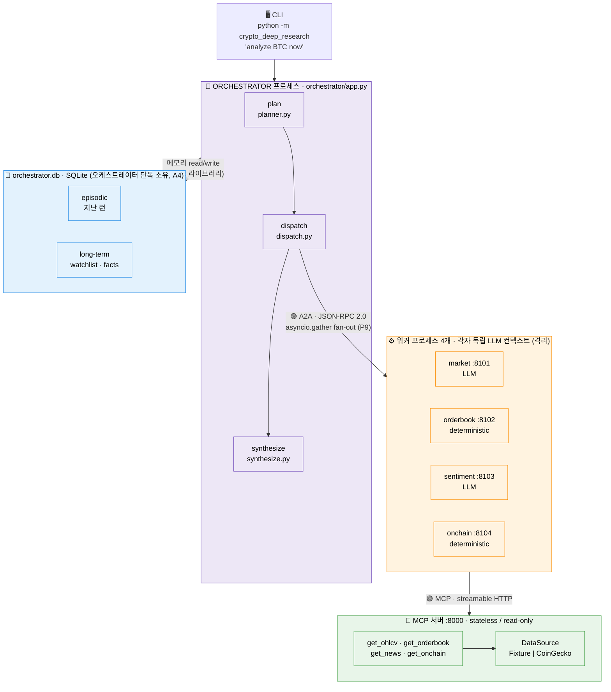
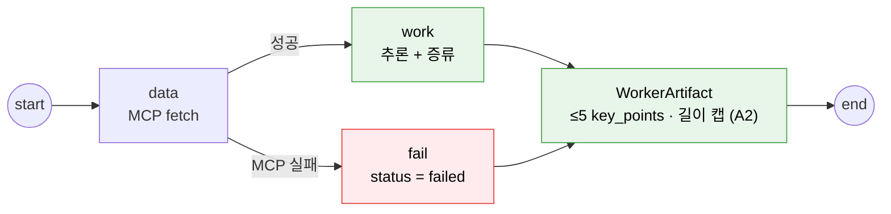

# 아키텍처 맵 — crypto_deep_research

> 실제 구현 코드(M5까지) 기준의 구조·설계도·코드 매핑 문서.
> 설계 의도는 [`DESIGN.md`](./DESIGN.md), 마일스톤은 [`specs/`](./specs/) 참고.

이 프로젝트는 "코인 분석"이 목적이 아니라 **2026 멀티에이전트 핵심 개념 5개를 실제 와이어로 학습**하는 게 목적이다. 그래서 모든 것이 **6개 프로세스로 분리**돼 있다.

```
orchestrator(1)  +  worker(4)  +  MCP 서버(1)  =  6 프로세스
```

**5대 개념** → Orchestrator-Worker · Context Isolation · Distillation · Layered Memory · MCP/A2A 분리

---

## 1. 시스템 토폴로지 (6개 프로세스)



| 경계 | 색 | 의미 |
|---|---|---|
| 🟣 **A2A** | 보라 | 에이전트 ↔ 에이전트 (오케스트레이터 → 워커), JSON-RPC over HTTP |
| 🟢 **MCP** | 초록 | 에이전트 ↔ 도구 (워커 → 코인데이터 서버), streamable HTTP |
| 🔵 **Memory** | 파랑 | 오케스트레이터 in-proc 라이브러리 + SQLite |

> **핵심 불변식:** 오케스트레이터 상태에는 **증류된 artifact만** 들어온다. 워커의 raw OHLCV 배열은 절대 넘어오지 않는다 (Context Isolation, A2).

---

## 2. 단일 요청 흐름 — "analyze BTC now"

```mermaid
sequenceDiagram
    autonumber
    participant U as CLI (__main__.py)
    participant O as Orchestrator (app.py)
    participant M as Memory (episodic+longterm)
    participant W as Workers ×N (A2A)
    participant D as MCP Server

    U->>O: run_orchestrator("BTC")
    O->>M: episodic.last_for("BTC")
    M-->>O: 지난 런 요약 (seed) · READ@run-start

    rect rgba(237,231,246,0.5)
    note over O: plan 노드
    O->>W: GET /.well-known/agent.json (discover)
    W-->>O: Agent Card → dimension 레지스트리
    O->>M: longterm.watchlist() / facts()
    M-->>O: 워커 집합 결정 · long-term READ
    end

    rect rgba(255,243,224,0.5)
    note over O: dispatch 노드 — asyncio.gather (병렬)
    O->>W: POST / analyze (JSON-RPC, 워커별 30s timeout)
    W->>D: get_ohlcv / orderbook / news / onchain
    D-->>W: 구조화 데이터
    note over W: data → work → distill
    W-->>O: WorkerArtifact (bounded) · raw 데이터 미전달
    end

    rect rgba(232,245,233,0.5)
    note over O: synthesize 노드 → status: ok / partial / failed
    end

    O->>M: episodic.put() + longterm.add_facts() · WRITE@run-end
    O-->>U: SynthesisReport (+ exit code; failed→1)
```

---

## 3. 워커 내부 그래프 (`data → work`)

모든 워커는 동일한 LangGraph 골격을 공유한다 (`workers/base.py`). MCP가 죽으면 LLM을 건드리기 전에 `fail`로 단락(short-circuit)된다 (A3).



- **LLM 워커** (market, sentiment): `work`이 `llm_distill`로 분석→압축
- **결정적 워커** (orderbook, onchain): `work`이 산술 계산으로 직접 artifact 생성 (LLM 없음)

---

## 4. 폴더별 책임

| 폴더 / 파일 | 책임 | 핵심 개념 |
|---|---|---|
| `contracts/` | 6개 서비스가 **공유하는 타입 계약** (로직 없음): A2A 와이어 타입, MCP I/O, `WorkerArtifact`, `SynthesisReport`, 메모리 Protocol | 계약 우선 (M0, C5) |
| `mcp_server/` | **에이전트-도구(MCP) 경계**. 코인데이터 4개 툴을 streamable-HTTP로 노출 | MCP |
| `mcp_server/sources/` | 데이터 소스: `fixture.py`(JSON), `coingecko.py`(라이브). M5 스왑이 여기서만 발생 | 도메인 stub→live |
| `workers/` | **4개 워커 에이전트**. 격리된 컨텍스트에서 MCP 호출→추론→증류. `base.py`가 공통 하네스 | Isolation + Distillation |
| `workers/<dim>/agent.py` | 워커별 도메인 로직 (`_fetch` MCP 호출 + `_work` 분석) | — |
| `workers/<dim>/service.py` | 워커별 **Agent Card** + A2A 서비스 래퍼 (얇음) | A2A |
| `orchestrator/` | **에이전트-에이전트(A2A) 경계**. plan→dispatch→synthesize. raw 데이터 미접근 | Orchestrator-Worker |
| `memory/` | **3계층 메모리**: working(워커 checkpointer DB) / episodic·longterm(오케스트레이터 SQLite) | Layered Memory |
| `wiring.py` | env 기반 정적 배선 (worker URL 목록, MCP URL, 타임아웃) | 데이터 주도 레지스트리 |
| `__main__.py` | CLI 진입점 | — |
| `serve_worker.py` | **워커 1개 프로세스 진입점** (`WORKER_KIND`로 선택). 일부러 `workers/` 밖 = 패키징 | M5 패키징 |
| `mcp_server/__main__.py` | MCP 서버 프로세스 진입점 (env로 소스 선택) | — |
| `tests/` | 개념별 검증 (격리/타임아웃/부분실패/메모리/소스스왑) | — |
| `Dockerfile`, `docker-compose.yml` | M5: 6 프로세스를 실제 OS 경계로 패키징 | — |

---

## 5. 설계 노드 ↔ 코드 매핑

### 5-1. 5대 개념

| 개념 | 어디서 실현 | 코드 (file:line) |
|---|---|---|
| **Orchestrator-Worker** | plan→dispatch→synthesize, 워커는 별도 프로세스 | `orchestrator/app.py:56`, `orchestrator/dispatch.py:58` |
| **Context Isolation** | 워커 = 독립 프로세스 + 독립 LLM 컨텍스트 | 프로세스: `serve_worker.py` / 상태=artifact만: `orchestrator/app.py:23` / 검증: `tests/test_isolation.py` |
| **Distillation** | distill 단계가 bounded `WorkerArtifact` 생성 | `workers/base.py:40` (`llm_distill`) / 경계 강제: `contracts/artifact.py:15-27` |
| **Layered Memory** | working / episodic / long-term 각자 read·write 트리거 | `memory/working.py`, `memory/episodic.py`, `memory/longterm.py` |
| **MCP / A2A 분리** | MCP=도구 경계, A2A=에이전트 경계 | MCP: `mcp_server/server.py` / A2A: `contracts/a2a.py` + `orchestrator/dispatch.py` |

### 5-2. 흐름 노드 ↔ 코드

| 설계도 노드 | 구현 함수 | file:line |
|---|---|---|
| CLI 진입/심볼 파싱 | `parse_symbol`, `main` | `__main__.py:22, 56` |
| 오케스트레이터 그래프 | `build_orchestrator` | `orchestrator/app.py:56-65` |
| **plan**: 워커 발견 | `discover` (Agent Card → 레지스트리) | `orchestrator/planner.py:34` |
| **plan**: long-term READ | `plan_dimensions` | `orchestrator/planner.py:45` |
| **dispatch**: A2A fan-out | `fan_out` / `dispatch_one` | `orchestrator/dispatch.py:58, 21` |
| **dispatch**: 타임아웃/실패→gap | `_dispatch_or_gap` | `orchestrator/dispatch.py:42` |
| 워커 그래프 골격 | `build_worker_graph` | `workers/base.py:68` |
| 워커 MCP 호출 (data) | `_fetch` / `_fetch_ohlcv` 등 | `workers/market/agent.py:19-28` |
| 워커 추론 (work) | `_work` | `workers/*/agent.py` |
| LLM 증류 | `llm_distill` | `workers/base.py:40` |
| 워커 A2A 서비스 | `build_worker_app` | `workers/base.py:132` |
| 워커별 Agent Card | `build_*_app` | `workers/<dim>/service.py` |
| **synthesize**: 병합+커버리지 | `synthesize` / `_gaps` / `_status` | `orchestrator/synthesize.py:34, 17, 26` |
| 리포트 렌더 / exit code | `render_report` / `exit_code` | `__main__.py:29, 38` |

### 5-3. MCP 서버

| 노드 | 코드 | file:line |
|---|---|---|
| 4개 툴 등록 | `build_server` | `mcp_server/server.py:15-41` |
| 데이터 소스 인터페이스 | `DataSource` Protocol | `mcp_server/sources/base.py:12` |
| Fixture 소스 (day-one) | `FixtureSource` | `mcp_server/sources/fixture.py:12` |
| 라이브 소스 (M5) | `CoinGeckoSource` / `source_from_env` | `mcp_server/sources/coingecko.py:43, 83` |
| 툴 I/O 스키마 | `OHLCV/Orderbook/News/OnchainMetrics` | `contracts/mcp_tools.py` |

### 5-4. Layered Memory (트리거별)

| 계층 | READ 트리거 | WRITE 트리거 | 코드 |
|---|---|---|---|
| **working** | distill 노드가 scratchpad 읽음 | 워커가 중간 노트 기록 (checkpointer DB) | `memory/working.py` |
| **episodic** | run 시작 `last_for(symbol)` → seed | run 끝 `put(record)` | `memory/episodic.py:26, 41` · 호출 `app.py:84, 98` |
| **long-term** | planner가 `watchlist`/`facts` 읽음 | run 끝 `add_facts` | `memory/longterm.py:22, 26, 30` · 호출 `planner.py:52-53`, `app.py:99` |

---

## 6. Eng-Review 잠금 결정 ↔ 코드

| 결정 | 내용 | 코드 |
|---|---|---|
| A1 | A2A = 직접 짠 JSON-RPC 2.0 + 정적 Agent Card | `contracts/a2a.py` |
| A2 | `WorkerArtifact` validator로 증류 경계 강제 | `contracts/artifact.py:22-27` |
| A3 | 워커별 30s 타임아웃, zero-artifact→`failed`+exit 1 | `dispatch.py:52`, `synthesize.py:26`, `__main__.py:38` |
| A4 | 워커별 checkpointer DB / 오케스트레이터가 episodic+longterm 단독 소유 | `memory/working.py:18` vs `episodic.py`+`longterm.py` (단일 `orchestrator.db`) |
| C6 | 2번째 워커 후 공통 하네스 추출 | `workers/base.py` |
| P9 | fan-out = `asyncio.gather` (LangGraph `Send` 금지) | `dispatch.py:58-70` |

---

## 7. 테스트 ↔ 검증 대상

| 테스트 | 검증 노드 |
|---|---|
| `test_contracts.py` | M0 계약 스키마 |
| `test_mcp_server.py` / `test_source_swap.py` | MCP 툴 / Fixture↔CoinGecko 스왑 |
| `test_market_worker.py` | 워커 `data→work→distill` |
| `test_a2a_market.py` | A2A 와이어 라운드트립 |
| `test_fanout.py` | 병렬 fan-out |
| `test_planner_longterm_read.py` / `test_longterm_affects_plan.py` | long-term READ가 plan 변경 |
| `test_isolation.py` | **격리 플래그십**: 1000행 OHLCV → artifact bounded + 오케스트레이터 raw 0 |
| `test_timeout.py` / `test_partial.py` / `test_zero_artifact.py` | A3 + TENSION-C (타임아웃/부분/전체 실패) |
| `test_episodic_roundtrip.py` | 두 번째 런이 첫 런 참조 |
| `test_db_topology.py` | A4 DB 단독 소유 토폴로지 |

---

## 8. ⚠️ 코드 ↔ 설계 갭 (정직한 메모)

설계 의도와 현재 코드가 살짝 어긋났던 두 지점. **둘 다 2026-06-10 리뷰 수정 배치(W1·W2, `dad06eb`)로 해소됨.**

1. **working 메모리가 라이브 경로에 미연결.** → **해소(W2):** `serve_worker.py`의 `__main__`이 `worker_checkpointer(working_db_path(MEMORY_DIR, kind))`를 열어 `build_app(cp)`로 각 워커 서비스에 주입한다 (`serve_worker.py:44-45`).

2. **`episodic_seed`가 워커까지 가지만 소비되지 않음.** → **해소(W1):** 워커 핸들러가 `rpc.params.episodic_seed`를 `analyze(...)`로 전달하고, `seed_context`가 prior-run 컨텍스트를 reason 프롬프트에 반영한다 (`workers/base.py:60-65`, `workers/base.py:168`).

---

## 부록: 빠른 실행 레퍼런스

```bash
# 로컬 (M1~M4): 프로세스 개별 실행
python -m crypto_deep_research.mcp_server                 # MCP 서버 :8000
python -m crypto_deep_research.serve_worker               # 워커 (WORKER_KIND env)
python -m crypto_deep_research "analyze BTC now"          # 오케스트레이터 (CLI)

# M5: 6 프로세스를 docker-compose로
docker compose up -d                                      # mcp + 워커 4개
docker compose run --rm orchestrator                      # 오케스트레이터 oneshot
```

핵심 env: `WORKER_URLS`(콤마 구분 목록), `MCP_URL`, `WORKER_TIMEOUT_S`(기본 30), `MEMORY_DIR`, `COIN_DATA_SOURCE`(fixture|coingecko), `ANTHROPIC_API_KEY`, `COINGECKO_API_KEY`.
