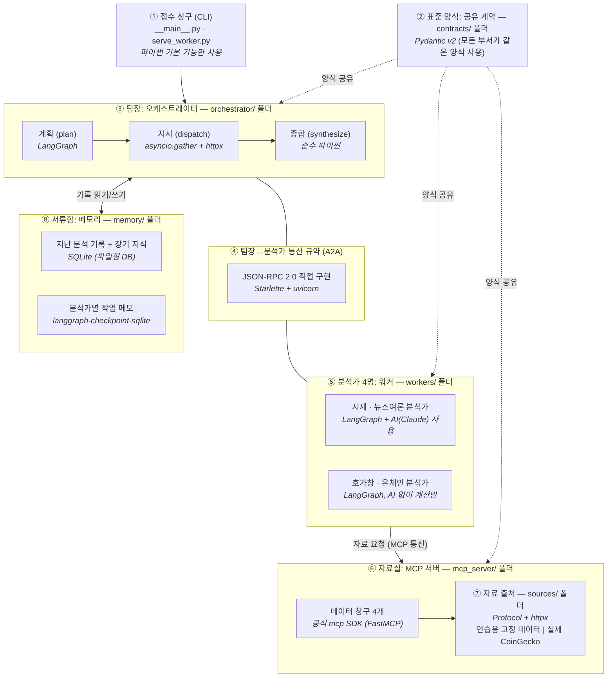

# 컴포넌트 설계도 & 기술 선택 근거 — crypto_deep_research

> **비개발자도 읽을 수 있게 쓴 문서입니다.** 이 시스템이 어떤 부품(컴포넌트)들로 이루어져 있고,
> 각 부품이 코드의 어느 폴더에 들어 있으며, 왜 하필 그 도구/프레임워크를 골랐는지를
> 비유와 예시로 설명합니다.
>
> 더 기술적인 구조도·흐름도·테스트 매핑은 [`ARCHITECTURE-MAP.md`](./ARCHITECTURE-MAP.md),
> 설계 결정의 원본 기록(A1~P9)은 [`DESIGN.md`](./DESIGN.md)에 있습니다.

---

## 0. 먼저: 이 시스템은 무엇을 하나요?

사용자가 `"analyze BTC now"`(비트코인 지금 분석해줘)라고 입력하면, 시스템이 **여러 명의
AI 분석가를 동시에 굴려서** 가격 흐름·호가창·뉴스 여론·블록체인 활동을 각각 조사하고,
그 결과를 **한 장의 종합 리포트**로 만들어 돌려줍니다.

이해를 돕는 비유로, 이 시스템 전체를 **작은 리서치 회사**라고 생각하면 됩니다:

| 회사 비유 | 시스템에서의 실제 이름 | 하는 일 |
|---|---|---|
| 고객 접수 창구 | CLI (명령줄 입력) | 고객의 요청("BTC 분석해줘")을 받아서 팀장에게 전달 |
| **팀장 (편집장)** | 오케스트레이터 (Orchestrator) | 누구에게 어떤 조사를 시킬지 계획하고, 결과를 모아 최종 리포트 작성 |
| **분석가 4명** | 워커 (Worker) ×4 | 각자 자기 전문 분야(시세/호가/뉴스/온체인)만 깊게 조사 |
| **자료실 사서** | MCP 서버 | 분석가들이 요청하는 원본 데이터(시세표, 뉴스 등)를 꺼내주는 유일한 창구 |
| 사내 표준 보고서 양식 | 공유 계약 (contracts) | 모든 부서가 같은 양식으로 소통하도록 강제하는 서식 모음 |
| 팀장의 서류함 | 메모리 (Memory) | "지난번 BTC 분석 때 뭐라고 했더라?" 같은 기록 보관 |

여기서 중요한 설계 철학이 하나 있습니다.
**팀장은 분석가의 책상(원본 자료 더미)을 절대 들여다보지 않습니다.**
분석가는 수천 줄짜리 원본 데이터를 자기 자리에서 소화한 뒤, **딱 한 장짜리 요약본**만
팀장에게 제출합니다. 팀장 책상이 원본 자료로 어지러워지는 순간 비용(토큰)이 폭발하고
판단이 흐려지기 때문입니다. 이것이 이 프로젝트가 연습하려는 핵심 개념
(**컨텍스트 격리 + 증류**)입니다.

또 하나: 이 프로젝트의 목적은 "코인 분석 잘하기"가 아니라, **2026년 멀티에이전트 시스템의
핵심 개념 5가지를 진짜 부품으로 직접 만들어 보며 배우는 것**입니다. 그래서 모든 기술
선택의 1순위 기준이 "성능"이나 "편리함"이 아니라 **"이걸 쓰면 그 개념을 제대로 배우게
되는가?"** 입니다. 이 기준을 기억하고 아래를 읽으면 모든 선택이 일관되게 보입니다.

---

## 1. 전체 설계도

아래 그림에서 ①~⑨ 번호가 각 컴포넌트(부품)입니다. 박스 안의 *기울임 글씨*가 그 부품을
만드는 데 쓴 기술 이름입니다 (각 기술은 3장에서 하나씩 풀어 설명합니다).



한 가지 더 알아둘 점: 이 시스템은 프로그램 하나가 아니라 **독립된 프로그램(프로세스)
6개**가 동시에 떠서 서로 통신합니다 — 팀장 1 + 분석가 4 + 자료실 1.
"프로세스"란 컴퓨터에서 따로 실행되는 프로그램 하나를 말합니다. 마치 직원들이 한 방에
모여 있는 게 아니라 **각자 독립된 사무실**에서 전화로만 소통하는 구조입니다. 일부러
이렇게 만들었습니다 — 사무실 벽이 있어야 "팀장이 분석가의 책상을 못 본다"는 격리가
말이 아니라 물리적 사실이 되기 때문입니다.

---

## 2. 컴포넌트 ↔ 폴더 매핑 — "이 기능은 어느 폴더에 있나"

코드 저장소의 폴더 구조와 위 그림의 부품이 1:1로 대응합니다.

| # | 컴포넌트 (비유) | 폴더 / 파일 | 그 안에 들어있는 기능 |
|---|---|---|---|
| ① | 접수 창구 | `__main__.py`, `serve_worker.py`, `mcp_server/__main__.py` | 사용자의 입력("analyze BTC now")에서 코인 이름을 읽어내고, 최종 리포트를 화면에 출력. 나머지 두 파일은 분석가/자료실 프로그램을 켜는 "전원 버튼" |
| ② | 표준 양식 모음 | `contracts/` | 모든 부서가 공유하는 서식 정의만 모아둔 폴더 (업무 로직은 0줄). 통신문 양식(`a2a.py`), 분석가 요약 보고서 양식(`artifact.py`), 자료실 데이터 양식(`mcp_tools.py`), 최종 리포트 양식(`report.py`), 서류함 사용 규칙(`memory.py`) |
| ③ | 팀장 | `orchestrator/` | `planner.py`: 어떤 분석가가 출근해 있는지 확인하고 누구를 투입할지 결정 → `dispatch.py`: 4명에게 동시에 업무 지시(전화) → `synthesize.py`: 돌아온 요약본들을 한 장 리포트로 종합. `app.py`: 이 3단계를 순서대로 묶음 |
| ④ | 통신 규약 (팀장↔분석가) | `contracts/a2a.py` + `workers/base.py`의 `build_worker_app` + `workers/*/service.py` | 전화 통화의 형식: 어떤 말로 지시하고 어떤 형식으로 답하는지, 그리고 각 분석가의 "명함"(이름·전문분야가 적힌 Agent Card) 제공 |
| ⑤ | 분석가 4명 | `workers/` | `base.py`: 4명이 공유하는 업무 매뉴얼(자료 받기→분석→요약). `market/`, `orderbook/`, `sentiment/`, `onchain/` 하위 폴더: 각 분석가의 전문 분야별 실제 분석 로직 |
| ⑥ | 자료실 사서 | `mcp_server/server.py` | 데이터 창구 4개: 시세표 주세요(`get_ohlcv`), 호가창 주세요(`get_orderbook`), 뉴스 주세요(`get_news`), 온체인 지표 주세요(`get_onchain`) |
| ⑦ | 자료 출처 | `mcp_server/sources/` | 사서가 자료를 어디서 가져오는지: `fixture.py`(연습용 고정 데이터 = 도서관의 견본 자료), `coingecko.py`(실제 인터넷 시세 API). 환경 설정 한 줄로 교체 가능 |
| ⑧ | 서류함 | `memory/` | `episodic.py`: "지난번 BTC 분석 결과" 기록. `longterm.py`: 관심 코인 목록 + 축적된 지식. `working.py`: 분석가 개인의 작업 중 메모장 |
| ⑨ | 사무실 배치도 | `wiring.py`, `Dockerfile`, `docker-compose.yml` | 누가 몇 번 전화(포트)를 쓰는지 적어둔 내선 번호부(`wiring.py`), 그리고 6개 프로그램을 각각 독립된 컨테이너(사무실)에 넣어 한 번에 켜는 설정 |

---

## 3. 컴포넌트별 기술 선택 근거 — "왜 하필 이 도구인가"

각 항목을 같은 형식으로 설명합니다:
**(이 기술이 뭔가) → (왜 골랐나) → (다른 후보는 왜 떨어졌나)**.

---

### ② 표준 양식 — Pydantic v2

**이게 뭔가요?** Pydantic은 "데이터가 정해진 양식에 맞는지 자동으로 검사해주는"
파이썬 라이브러리입니다. 공항 보안검색대라고 생각하면 됩니다 — 규격에 안 맞는 짐은
그 자리에서 걸러냅니다.

**여기서 어떻게 쓰이나요?** 분석가가 팀장에게 내는 요약 보고서(`WorkerArtifact`)에는
엄격한 양식 규칙이 있습니다: **핵심 요점은 최대 5개, 각 문장 길이 제한, 근거는 반드시
"지표 이름 + 수치" 형태**(예: `{"metric": "RSI_14", "value": 71.2}`). 분석가가 규칙을
어기고 장황한 보고서를 내밀면, Pydantic이 보고서를 **접수 단계에서 반려**합니다.

**왜 이게 중요한가요?** "분석가는 요약본만 제출한다"는 이 시스템의 핵심 철학이
*말로 하는 약속*이 아니라 *기계가 강제하는 규칙*이 되기 때문입니다. 사람이 깜빡해도
시스템이 막아줍니다.

**다른 후보와 비교:**

| 후보 | 왜 떨어졌나 (비유와 함께) |
|---|---|
| 파이썬 기본 `dataclass` / `TypedDict` | 양식의 "이름표"만 붙이고 **검사는 안 합니다.** "요점 5개까지"라고 적어만 두고 6개를 내도 통과시키는 셈. 부서 간에 데이터가 실제로 오가는 시스템에선 검사가 핵심입니다. |
| protobuf / JSON Schema (코드 자동 생성 방식) | 대기업처럼 여러 언어(파이썬·자바·고)를 쓰는 조직에서 양식을 공유할 때 좋은 도구입니다. 이 프로젝트는 6개 부품이 전부 파이썬 한 언어라서, 그 도구를 쓰면 **번역기만 하나 더 관리하게** 됩니다. |

**보너스:** AI(Claude)에게 "이 양식대로 답을 채워줘"라고 시킬 때도 같은 Pydantic 양식을
그대로 건네줄 수 있어서(⑤ 참고), 양식이 회사 전체에 하나로 통일됩니다.

---

### ③ 팀장(오케스트레이터) — LangGraph + asyncio.gather + httpx

팀장의 업무는 3단계입니다: **계획 → 지시 → 종합**. 각 단계에 쓰인 기술이 다릅니다.

#### (a) 업무 순서도: LangGraph

**이게 뭔가요?** LangGraph는 AI 에이전트의 업무 흐름을 **순서도(그래프)** 형태로 짜는
프레임워크입니다. "계획이 끝나면 지시로, 지시가 끝나면 종합으로" 같은 흐름을 코드로
명시하고, 각 단계 사이에 상태를 저장(체크포인트)할 수도 있습니다.

**왜 골랐나요?** 솔직한 이유: **LangGraph 자체가 이 프로젝트의 학습 목표 중 하나**라서
이전 세션에서 이미 확정된 선택입니다. 순서도가 코드에 명시적으로 드러나기 때문에
"멀티에이전트의 뼈대"를 눈으로 보며 배우기에 좋습니다.

#### (b) 동시 지시: asyncio.gather (파이썬 내장 기능)

**이게 뭔가요?** "4명에게 **동시에** 전화를 걸고, 전부 답할 때까지 기다리는" 파이썬의
기본 기능입니다. 한 명씩 차례로 전화하면 4배의 시간이 걸리지만, 동시에 걸면 가장
느린 한 명만큼만 기다리면 됩니다.

**중요한 비하인드 — 일부러 안 쓴 기능이 있습니다.** LangGraph에는 `Send`라는 자체
"동시 실행" 기능이 있고, 언뜻 보면 그게 더 프레임워크다운 선택입니다. 하지만 `Send`는
**같은 사무실 안에서만 작동하는 사내 인터폰**입니다. 우리 분석가들은 독립된 사무실
(별도 프로세스)에 있으므로 인터폰이 닿지 않습니다. 만약 `Send`를 쓰면 분석가들을 전부
팀장 사무실로 불러들여야 하고, 그 순간 "독립 사무실로 격리한다"는 이 프로젝트의 설계가
**소리 없이 무너집니다.** 그래서 설계 결정 P9로 "절대 `Send` 금지, 진짜 전화
(`asyncio.gather` + HTTP)만 사용"을 박아뒀습니다.

#### (c) 전화기: httpx

**이게 뭔가요?** 인터넷으로 요청을 보내는 라이브러리(HTTP 클라이언트)입니다.

**왜 골랐나요?** 두 가지 때문입니다.
1. **동시 통화 지원(비동기).** 가장 유명한 대안인 `requests`는 한 번에 한 통화만
   가능해서, 4명 동시 지시가 불가능해집니다.
2. **통화별 제한시간 설정이 쉬움.** "분석가가 30초 안에 답 못 하면 끊고, 그 분야는
   '자료 없음'으로 표시한다"는 규칙(설계 결정 A3)을 한 줄로 구현할 수 있습니다.
   예: 뉴스 분석가가 먹통이어도 전체 리포트는 나머지 3개 분야로 완성되고,
   "뉴스: 시간 초과로 누락"이라고 정직하게 표시됩니다.

#### (d) 종합 단계: 순수 파이썬

요약본들을 합치고 "전부 성공 / 일부 누락 / 전부 실패"를 판정하는 일은 단순 규칙이라
아무 프레임워크도 안 썼습니다. **도구가 필요 없는 곳에 도구를 안 쓰는 것도 선택**입니다.

---

### ④ 팀장↔분석가 통신 규약 (A2A) — JSON-RPC 2.0 직접 구현 + Starlette

**A2A가 뭔가요?** Agent-to-Agent, 즉 **AI 에이전트끼리 대화하는 표준 통신 규약**입니다.
팀장(에이전트)이 분석가(에이전트)에게 일을 시킬 때 쓰는 전화 예절이라고 보면 됩니다.

**JSON-RPC 2.0이 뭔가요?** "요청과 응답을 어떤 형식의 문장으로 주고받을지" 정한 아주
단순하고 오래된 약속입니다. 예를 들어 팀장의 지시는 이런 모양입니다:

```json
{ "jsonrpc": "2.0", "id": "run-42", "method": "analyze",
  "params": { "symbol": "BTC" } }
```

"42번 업무로, BTC를 analyze 하라" — 사람이 읽어도 뜻이 보이는 수준의 형식입니다.

**가장 논쟁적이었던 선택: 공식 SDK를 안 쓰고 직접 만들었습니다 (설계 결정 A1).**

| 후보 | 왜 떨어졌나 |
|---|---|
| 구글이 주도하는 공식 `a2a` SDK (완제품 라이브러리) | **운전을 배우는 게 목적인 사람에게 자율주행차를 주는 격**이기 때문입니다. SDK를 쓰면 통신은 되지만, 통신문이 어떻게 생겼고 에러가 나면 어떤 코드(-32700 = 문장 자체가 깨짐, -32600 = 양식 위반)로 답해야 하는지를 전부 SDK가 숨겨버립니다. 이 프로젝트는 그 "프로토콜의 모양"을 배우는 게 목적이므로, 핵심 부분만 최소한으로 직접 만들었습니다. 원래 설계 문서에도 "SDK가 발목을 잡으면 직접 구현으로 전환"이 예비 계획으로 적혀 있었고, 검토 끝에 그 길이 본선이 됐습니다. |

**분석가들의 "명함" — Agent Card.** 각 분석가는 자기 주소의 정해진 위치
(`/.well-known/agent.json`)에 명함을 걸어둡니다: "저는 market 분석가이고, analyze
업무를 받습니다." 팀장은 아침마다(매 실행마다) 이 명함들을 읽고 출근한 분석가 명단을
만듭니다. 그래서 **분석가를 한 명 더 채용해도 팀장 코드는 한 줄도 안 바뀝니다** —
내선 번호부(환경 변수)에 주소만 추가하면 됩니다.

**전화 받는 장비: Starlette + uvicorn.** 분석가 쪽에서 전화를 받으려면 작은 웹 서버가
필요합니다. Starlette은 아주 가벼운 웹 서버 골격, uvicorn은 그걸 실제로 돌리는 엔진입니다.

| 후보 | 왜 떨어졌나 |
|---|---|
| FastAPI (파이썬에서 제일 인기 있는 웹 프레임워크) | FastAPI의 강점은 자동 API 문서, 복잡한 입력 검증, 의존성 주입 같은 **대형 서비스용 편의 기능**입니다. 그런데 분석가의 창구는 딱 2개(업무 접수 1개 + 명함 1개)뿐이고, 입력 검증은 이미 ② Pydantic 양식이 합니다. **창구 2개 열자고 백화점 건물을 임대하지 않는다** — 그래서 FastAPI의 토대인 Starlette만 떼어 썼습니다. |
| Flask (구형 방식 웹 프레임워크) | 동시 처리(비동기)를 기본 지원하지 않아, AI 호출처럼 오래 걸리는 일을 받는 동안 전화가 불통이 됩니다. 또한 테스트할 때 "진짜 네트워크 없이 가짜 전화선으로 통화 내용만 검증"하는 기법(설계 결정 T8)을 쓰려면 비동기(ASGI) 방식이어야 합니다. |

---

### ⑤ 분석가(워커) — LangGraph + langchain-anthropic (AI는 2명만)

**모든 분석가의 공통 업무 매뉴얼** (`workers/base.py`): ① 자료실에서 데이터 받기 →
② 분석하기 → ③ 한 장 요약으로 압축하기. 단, 자료실이 먹통이면 **AI를 부르기 전에**
즉시 "이 분야 자료 없음"으로 보고하고 끝냅니다 (먹통인데 AI 비용까지 쓰는 낭비 방지).

**핵심 결정 1: 분석가 4명 중 2명만 AI를 씁니다.**

| 분석가 | AI 사용? | 이유 (예시와 함께) |
|---|---|---|
| 시세(market), 뉴스여론(sentiment) | ✅ 사용 (Claude) | "최근 가격 흐름이 상승 추세인가?", "이 뉴스들의 분위기가 긍정적인가?"는 **해석과 감이 필요한 일**입니다. |
| 호가창(orderbook), 온체인(onchain) | ❌ 계산만 | "매수·매도 호가 차이는 0.05%", "활성 주소 수가 지난주보다 12% 증가" — **계산기로 끝나는 일**입니다. 여기에 AI를 쓰면 비용이 들고, 같은 입력에 매번 다른 답이 나올 위험(비결정성)만 생깁니다. |

이 구분에는 학습 목적도 있습니다: "격리와 증류는 AI 없이도 성립하는 *구조*의 성질"
이라는 걸 계산-전용 분석가가 증명합니다.

**핵심 결정 2: AI 호출은 `langchain-anthropic` 경유.**

**이게 뭔가요?** Anthropic의 Claude AI를 LangChain/LangGraph 생태계 방식으로 부르는
연결 라이브러리입니다.

| 후보 | 왜 떨어졌나 |
|---|---|
| Anthropic 공식 SDK 직접 호출 | 가능은 하지만, 결정적 편의 기능 하나를 포기하게 됩니다: `with_structured_output`. 이 기능은 AI에게 **"답을 반드시 이 양식(Pydantic)에 맞춰 내라"**고 강제하고, 돌아온 답을 자동으로 양식 객체로 만들어줍니다. 예를 들어 "헤드라인 1줄 + 요점 3~5개 + 근거 2개 이상" 양식을 주면 AI의 자유 서술문을 직접 파싱하는 코드를 쓸 필요가 없어집니다. ②의 양식 체계와 그대로 이어지고, LangGraph와 같은 생태계라 마찰도 없습니다. |

**핵심 결정 3: 공통 매뉴얼은 "나중에" 만들었습니다.** 첫 분석가(market)는 매뉴얼 없이
구체적으로 먼저 만들고, **두 번째 분석가를 만들면서 중복이 실제로 보일 때** 공통 부분을
`base.py`로 추출했습니다 (설계 결정 C6). "언젠가 필요할 것 같은" 추상화를 미리 만들지
않는다는 원칙의 실천입니다.

---

### ⑥ 자료실(MCP 서버) — 공식 mcp SDK (FastMCP) + streamable HTTP

**MCP가 뭔가요?** Model Context Protocol — **AI가 외부 도구·데이터에 접근할 때 쓰는
업계 표준 규격**입니다. 전자제품의 "표준 콘센트 규격" 같은 것입니다. 자료실이 MCP
규격으로 창구를 열어두면, 어떤 AI 에이전트든 표준 플러그로 꽂아 쓸 수 있습니다.

**가장 눈여겨볼 지점: ④에서는 통신 규약을 직접 만들었는데, 여기서는 공식 SDK를
썼습니다. 모순이 아니라 의도된 비대칭입니다.**

- **A2A(④)에서 배우려던 것** = 프로토콜의 *내부 모양* → 직접 만들어야 배운다.
- **MCP(⑥)에서 배우려는 것** = "에이전트와 도구 사이에 표준 경계를 둔다"는 *위치와
  개념* → 경계가 어디 있는지가 핵심이지, 규격 문서를 손으로 재구현하는 건 배움이 아니다.
  공식 SDK의 `@mcp.tool()` 데코레이터(함수에 붙이는 표식)를 쓰면 함수 하나가 곧
  표준 창구 하나가 되고, 입출력 규격 문서도 자동 생성됩니다.

운전 비유를 이어가면: **운전(A2A)은 직접 배우고, 도로(MCP)는 직접 깔지 않는다.**

**통신 방식: streamable HTTP (stdio 대신).**

| 후보 | 왜 떨어졌나 |
|---|---|
| stdio 방식 (MCP의 기본 옵션) | stdio는 **부모 프로그램이 자식 프로그램을 직접 켜서 1:1 직통 인터폰으로** 쓰는 방식입니다. Claude Desktop 같은 데스크톱 앱에 도구를 붙일 땐 좋지만, 우리 자료실은 **독립 사무실(별도 프로세스/컨테이너)이고 분석가 4명이 동시에** 걸어옵니다. 여러 명이 동시에 걸 수 있는 일반 전화선(HTTP)이 맞습니다. |

**동시 접속이 안전한 이유:** 자료실은 **읽기 전용 + 무상태(stateless)**입니다. 사서는
요청받은 자료를 꺼내줄 뿐 아무것도 기록하지 않으므로, 4명이 동시에 와도 서로 간섭할
것이 없습니다 (설계 결정 A4).

---

### ⑦ 자료 출처 — typing.Protocol (교체 가능한 부품 설계)

**상황:** 자료실 사서는 자료를 두 곳 중 하나에서 가져옵니다.
- **연습용 고정 데이터** (`fixture.py`): 미리 만들어둔 견본 시세표. 인터넷 불필요,
  매번 같은 값 → 개발·테스트용.
- **실제 CoinGecko API** (`coingecko.py`): 진짜 인터넷에서 실시간 시세를 받아옴.

**Protocol이 뭔가요?** 파이썬의 "자격 요건 명세"입니다. "시세표를 줄 수 있고, 호가창을
줄 수 있고, …" — **요건 4가지를 충족하는 부품이면 무엇이든 꽂을 수 있다**고 선언하는
방식입니다. 채용 공고에 비유하면, "특정 학교 출신(상속)"이 아니라 **"이 4가지 업무가
가능한 사람"**이라고 자격만 명시하는 것입니다.

**효과 (이 프로젝트에서 실제로 일어난 일):** 개발 막바지(M5)에 연습용 데이터를 실제
CoinGecko로 바꿨는데, **분석가·팀장 코드는 0줄 수정**이었습니다. 환경 설정값
`COIN_DATA_SOURCE=coingecko` 한 줄로 부품만 갈아끼웠고, 이게 정말 0줄인지 확인하는
자동 테스트(`test_source_swap.py`)도 있습니다.

| 후보 | 왜 떨어졌나 |
|---|---|
| ABC (추상 클래스 상속 방식) | 같은 효과를 내지만 모든 부품이 본사 클래스를 import해서 상속해야 하는 형식적 결합이 생깁니다. Protocol은 "모양만 맞으면 통과"라 더 느슨하고 단순합니다. |

---

### ⑧ 서류함(메모리) — SQLite (파일형 데이터베이스)

**메모리는 3층 구조**이고, 각 층마다 "언제 읽고 언제 쓰는지"가 명확히 정해져 있습니다
(설계 원칙: 읽기/쓰기 시점이 없는 메모리 층은 장식일 뿐이다).

| 층 | 비유 | 읽는 시점 → 쓰는 시점 (예시) |
|---|---|---|
| working (작업 메모) | 분석가 개인의 포스트잇 | 분석 도중 중간 메모 → 요약 작성 때 참조. 한 건의 분석 안에서만 유효 |
| episodic (일화 기록) | "지난번 BTC 보고서" 파일철 | 분석 시작 때 "지난 런: BTC 과매수 경고"를 읽어 분석가에게 전달("그때 대비 뭐가 달라졌나?") → 분석 종료 때 이번 결과 저장 |
| long-term (장기 지식) | 회사의 관심 종목 리스트 + 축적 지식 | **계획 단계**에서 팀장이 읽음 — 장기 지식이 "누구를 투입할지"를 실제로 바꿈 → 분석 종료 때 새로 배운 사실 추가 |

**SQLite가 뭔가요?** 별도 서버 없이 **파일 하나가 곧 데이터베이스**인 초경량 DB입니다.
엑셀 파일처럼 폴더에 놓이는 `.db` 파일이지만, 안에서는 정식 데이터베이스 질의가 됩니다.

| 후보 | 왜 떨어졌나 |
|---|---|
| Redis / PostgreSQL (서버형 DB) | 성능·기능은 더 좋지만 **24시간 돌봐야 할 일곱 번째 프로그램**이 추가됩니다. 설계 문서의 표현을 빌리면: "진짜 통신선이 필요한 개념은 MCP와 A2A이지, 메모리가 아니다." 메모리는 팀장이 쓰는 사내 서류함이면 충분합니다. |
| 벡터 DB (Pinecone 등, AI 검색용 DB) | "비슷한 의미의 문서 찾기"가 필요할 때 쓰는 도구입니다. 우리의 장기 기억은 "관심 코인 목록 + 단순 사실 목록" 수준이라 일반 검색으로 충분 — 과잉 장비입니다. |
| working 메모리 자체 제작 | LangGraph에 그래프 상태를 저장하는 체크포인터(`SqliteSaver`)가 이미 있어서 재활용했습니다. 단, "체크포인터는 저장 *수단*이고, 메모리는 *개념*"이라는 구분은 유지합니다. |

**SQLite의 유일한 약점과 그 해법:** SQLite는 **여러 프로그램이 같은 파일에 동시에 쓰면**
충돌이 납니다. 그래서 규칙을 정했습니다 (설계 결정 A4): **"한 노트에는 한 사람만 펜을
든다"** — 분석가는 각자 자기 메모장 파일만, 팀장은 자기 서류함(`orchestrator.db`)만
씁니다. 자료실은 아예 아무것도 기록하지 않습니다. 기술로 푸는 대신 **소유권 배치
(토폴로지)로 문제 자체를 없앤** 사례이고, 이 배치가 지켜지는지도 자동 테스트
(`test_db_topology.py`)로 검증합니다.

---

### ⑨ 패키징·품질 도구 — docker-compose / uv / ruff / mypy / pytest

**docker-compose가 뭔가요?** 프로그램 6개를 각각 격리된 상자(컨테이너)에 담아 **명령
한 번으로 동시에 켜는** 도구입니다. "직원 6명에게 각자 사무실을 배정하고 출근시키는
건물 관리 시스템"입니다.

**왜 필요한가요?** "분석가들은 독립 사무실에 있다"는 이 프로젝트의 핵심 주장을 운영체제
수준의 **진짜 벽**으로 증명하는 단계(M5)이기 때문입니다.

| 후보 | 왜 떨어졌나 |
|---|---|
| Kubernetes (대규모 컨테이너 운영 도구) | 수백 대 서버를 운영하는 회사용 장비입니다. 노트북 한 대에서 돌리는 학습 프로젝트에는 명백한 과잉. |
| 그냥 프로그램 하나로 합치기 | 가장 쉽지만, "격리"가 코드상의 약속으로 격하됩니다. 벽이 없으면 격리를 배웠다고 말할 수 없습니다. |

**개발 보조 도구 (사용자는 몰라도 되지만 적어두면):**
- **uv** — 필요한 라이브러리를 정확한 버전으로 설치해주는 빠른 패키지 관리자.
  (참고: 이 개발 머신은 보안 프로그램이 인터넷 인증서를 가로채는 환경이라,
  설정에 `system-certs = true`를 켜둬야 설치가 됩니다.)
- **ruff** (코드 스타일 검사), **mypy** (타입 오류 검사), **pytest** (자동 테스트 실행),
  **pre-commit** (저장소에 기록하기 전 위 검사들을 강제 실행) — 사람의 실수를 기계가
  먼저 잡는 4중 안전망입니다.
- **CI(원격 자동 검사)는 일부러 안 만들었습니다** — 원격 저장소도 없는 1인 학습
  프로젝트에 CI는 금도금(gold-plating)이라는 판단이 설계 문서에 기록돼 있습니다.

---

## 4. 모든 선택을 관통하는 원칙 4가지

위의 개별 결정들은 사실 네 문장으로 압축됩니다.

1. **배우려는 대상이면 직접 만들고, 배경이면 완제품을 쓴다.**
   A2A 통신은 직접 구현(운전은 직접 배운다) ↔ MCP 서버는 공식 SDK(도로는 직접 깔지
   않는다). 이 비대칭이 우연이 아니라 이 프로젝트에서 가장 의도적인 선택입니다.

2. **움직이는 부품을 최소화한다.**
   메모리는 DB 서버 대신 파일 하나, 웹 서버는 백화점(FastAPI) 대신 창구 2개(Starlette),
   접수 창구는 프레임워크 없이 파이썬 기본 기능만.

3. **약속은 말이 아니라 타입(양식)으로 강제한다.**
   "요약만 제출" → Pydantic 검사기가 반려. "데이터 출처는 교체 가능" → Protocol 자격
   명세 + 교체 테스트. 사람의 기억력 대신 기계가 규칙을 지킵니다.

4. **편하지만 경계를 무너뜨리는 기능은 쓰지 않는다.**
   LangGraph `Send`가 더 "프레임워크다운" 동시 실행 방법이지만, 사무실 벽(프로세스
   경계)을 통과하지 못해 격리 설계를 조용히 붕괴시키므로 금지하고(P9), 진짜 전화
   (`asyncio.gather` + HTTP)를 씁니다.
